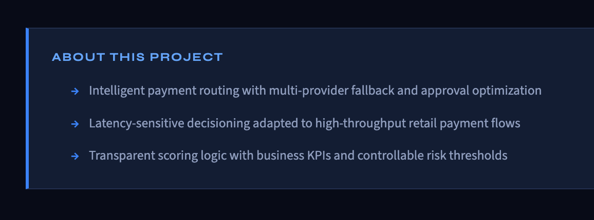
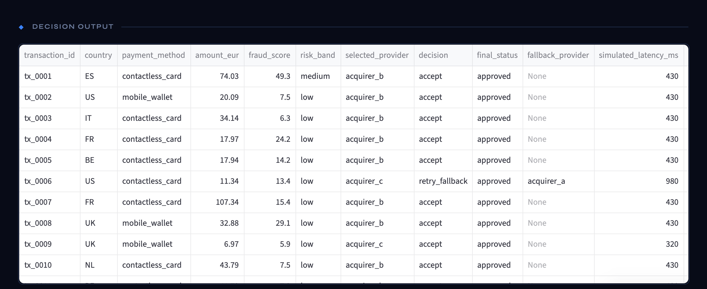
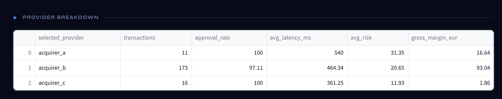
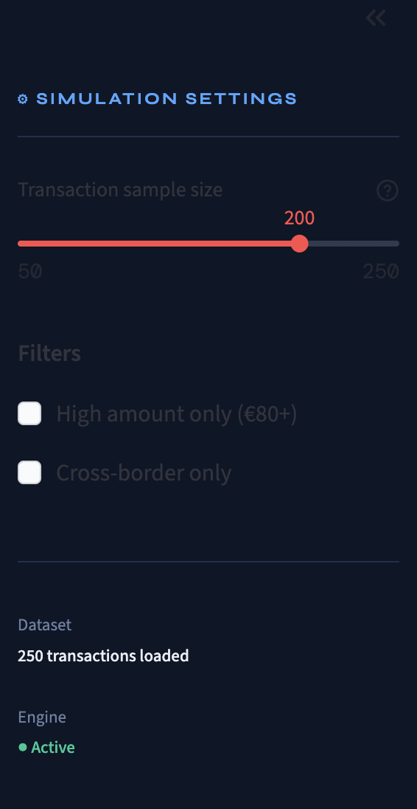

# Payment Decision Engine

> Intelligent routing, fraud scoring, and approval optimization for payment systems at scale.


---


## Why this matters now — the PSD3 / PSR reframe

The Council of the EU published the final compromise texts for **PSD3 and the Payment Services Regulation on 23 April 2026**. Publication in the Official Journal is expected in Q2 2026, with general application ~21 months later (late 2027 / early 2028).

PSD2 prescribed actions. PSD3/PSR prescribes an **objective function** — explicit liability allocation across every decision:

- Apply Verification of Payee, or absorb the loss.
- Monitor in real-time with environmental and device signals, or absorb the loss.
- Block when warranted, with a documented rationale, or absorb the loss.
- Fail to log a reasoned decision, lose the dispute.

This repository works through the **product implications** of that shift. It is structured as a Group PM would structure a multi-quarter domain redesign: problem framing → decision framework → article mapping → reference implementation.

The original engine optimised approval rate. This evolution reframes the same engine around **expected regulatory cost** — because under PSR, those two objectives are no longer the same.

📄 Full strategic memo: [`docs/01_problem_framing.md`](docs/01_problem_framing.md)
📄 PSR article mapping: [`docs/03_psr_article_mapping.md`](docs/03_psr_article_mapping.md)

---
## Context

In large-scale payment systems, every failed transaction has a direct business impact — lost revenue, degraded customer experience, and increased operational cost. Yet most systems still rely on static routing rules.

This project explores a different approach: **what if payment routing decisions were dynamic, data-driven, and optimized in real time?**

---

## Problem Statement

A payment can fail for multiple reasons: issuer rejection, fraud suspicion, provider instability, or latency constraints. At scale, even a marginal improvement in approval rate can represent **millions in recovered revenue**.

The challenge is to build a system that makes smarter routing decisions — in real time, at transaction level, with full business explainability.

---

## Solution



The **Payment Decision Engine** simulates an AI-powered decisioning layer that:

- selects the optimal provider for each transaction based on risk and context
- predicts success probability per provider
- triggers fallback strategies on failure
- surfaces business KPIs (approval rate, margin, latency) in real time

---

## Product Walkthrough

### Decision Output



Each transaction is analyzed and routed based on risk signals, provider performance history, and contextual data (amount, geography, payment method).

---

### Provider Performance Analysis



The engine compares multiple acquirers across dimensions (approval rate, latency, margin) and selects dynamically per transaction.

---

### Simulation Controls



The Streamlit dashboard allows testing different traffic conditions, filters, and routing strategies interactively.

---

## Business Impact (Simulation)

| Metric | Value |
|---|---|
| Approval Rate | **97.5%** |
| Fallback Recovery | **+5% transactions recovered** |
| Avg Decision Latency | **~460 ms** |
| Simulated Gross Margin | **€111+** |

Smarter routing translates directly into measurable revenue recovery.

---

## How It Works

### Decision Flow
```
Transaction received
       ↓
Risk & context evaluation
       ↓
Success probability predicted per provider
       ↓
Best provider selected
       ↓
Failure? → Fallback triggered
       ↓
Final decision returned
```

### Smart Fallback — Example
```
Attempt 1  →  acquirer_c  →  FAILED
Attempt 2  →  acquirer_a  →  APPROVED
```

Failed payments are recovered automatically without user intervention.

### Provider Strategy

| Provider | Strength |
|---|---|
| `acquirer_a` | High approval rate |
| `acquirer_b` | Balanced performance |
| `acquirer_c` | Low latency |

The engine arbitrates dynamically based on transaction context, not static rules.

---

## Features

- Intelligent multi-provider routing engine
- Fallback and retry logic with provider memory
- Fraud score integration and risk banding
- Business KPI simulation (margin, latency, approval rate)
- Latency-aware decisions
- Extensible ML scoring layer (LightGBM / XGBoost ready)

---

## Getting Started
```bash
# 1. Generate synthetic data
python src/data_generator.py

# 2. Train the scoring model
python src/model.py

# 3. Run the decision engine
python main.py

# 4. Launch the dashboard
streamlit run app/streamlit_app.py
```

---

## Tech Stack

| Layer | Tools |
|---|---|
| Language | Python 3.10+ |
| Data | pandas, numpy |
| ML | scikit-learn, LightGBM *(optional)*, SHAP *(optional)* |
| Dashboard | Streamlit |
| Visualization | Matplotlib |

---

## Product Thinking

This project reflects a product + engineering mindset applied to a real payment operations problem:

- translating business constraints into a decision system
- balancing trade-offs between risk, cost, and performance
- building logic that is explainable, auditable, and extensible
- using simulation to validate hypotheses before production

---

## Disclaimer

This project uses **synthetic data** and is designed for demonstration and portfolio purposes only. It does not represent any production system or real transaction data.

## Going further

The full reference implementation — including the liability cost model, 
the PSR-compliant decision logger, the executable Streamlit dashboard, 
and the 18-month domain roadmap — is shared on request with payments 
product leaders, regulators, and serious recruitment conversations.

Reach out via LinkedIn: linkedin.com/in/karim-ouriachi-a7217127

---

*Built to demonstrate applied product thinking in payment systems — routing optimization, fraud decisioning, and business KPI modeling.*
